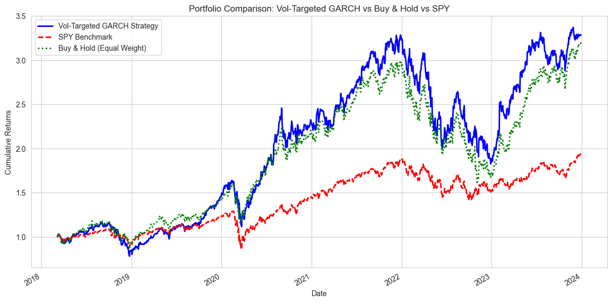
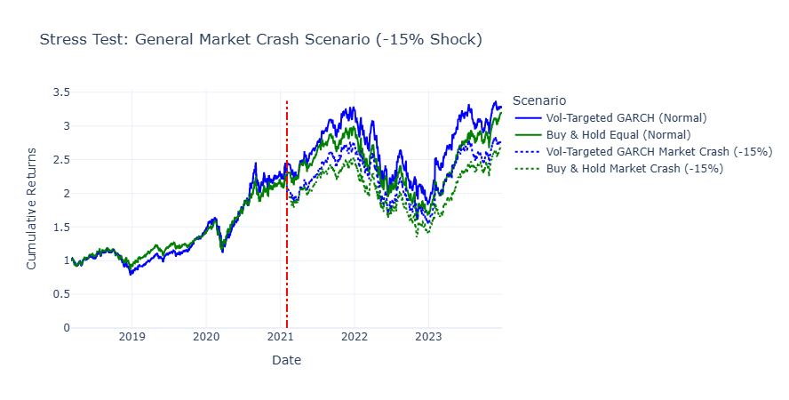

# Stock Forecasting & Dynamic Portfolio Optimization

This repository presents an end-to-end quantitative finance workflow, moving from advanced single-asset forecasting models (ARIMA, GARCH, LSTM, XGBoost) to sophisticated, dynamically rebalanced portfolio optimization strategies (Markowitz MVO, Minimum Volatility, Risk Parity).

The project culminates in a **Volatility-Targeted GARCH Portfolio Optimization strategy**, which uses GARCH volatility forecasts to inform dynamic asset allocation, aiming for superior risk-adjusted returns.

## Repository Structure

| Notebook File | Focus | Key Methodology |
| :--- | :--- | :--- |
| `stock_forecasting_notebook.ipynb` | Single-Asset Price and Volatility Forecasting | SARIMAX, GARCH, LSTM, XGBoost, LightGBM |
| `portfolio_optimization_notebook.ipynb` | Portfolio Strategy Comparison & Backtesting | Markowitz Mean-Variance Optimization (MVO), Minimum Volatility, Risk Parity, Black-Litterman |
| `combined_notebook.ipynb` | Strategy Synthesis & Dynamic Allocation | GARCH-based Volatility Forecasting integrated into MVO |

-----

## 1. Stock Forecasting Notebook: Model Comparison

**Goal:** Determine the most robust forecasting model for both price direction and volatility on the target tickers (`AAPL`, `MSFT`, `GOOGL`, `AMZN`, `META`).

**Key Models & Findings:**

  * **SARIMAX (Time Series):** Provides **accurate, level-aligned, and reproducible estimates**, making it robust for backtesting, especially for trending assets, although it does not inherently account for volatility.
  * **GARCH (Volatility):** **Pure GARCH Vol-Targeting** was found to be the **most robust** for consistent performance across multiple tickers, often delivering the **highest risk-adjusted returns** by predicting and reacting to volatility clustering.
  * **Deep Learning (LSTM):** While capable of capturing trend direction, the LSTM model exhibited **systematic underprediction** and smoothing, making its raw price output less suitable for direct use in portfolio simulation.

**Conclusion:** The **GARCH model** was identified as the crucial component for building a robust, risk-aware strategy, providing superior results in volatility control.

-----

## 2. Portfolio Optimization Notebook: Strategy Comparison

**Goal:** Compare historical and stress-tested performance of different classic optimization strategies against a market benchmark (`SPY`).

**Key Strategies & Findings:**

| Strategy | Performance Under Normal Conditions | Performance Under Stress Conditions |
| :--- | :--- | :--- |
| **MVO (Max Sharpe)** | **Highest Risk-Adjusted Return ($\text{Sharpe}=1.33$)** | Achieved the **Highest Total Return ($>1000\%$ in Market Crash)** but with high drawdowns. |
| **Min Vol** | Best Volatility Control | Exhibited the **Best Risk Control in Market Crash** ($\text{Drawdown}=-30.29\%$). |
| **Benchmark (SPY)** | Lowest Efficiency ($\text{Sharpe}=0.74$) | Demonstrated the **Best Capital Preservation** (Drawdown $\approx -15\%$ in both tech and market crashes). |

**Conclusion:** The **Markowitz MVO** strategy was selected as the foundational allocation method due to its **superior risk-adjusted returns** ($\text{Sharpe}=1.33$) under normal conditions.

-----

## 3. Combined Notebook: Dynamic Volatility-Targeted Allocation

**Goal:** Integrate the best elements from the prior notebooks - **GARCH volatility forecasts** and **Markowitz MVO** - to create a dynamic, risk-aware portfolio strategy.

**Strategy Implemented:**
**Volatility-Targeted GARCH Portfolio Optimization.** This implements a **dynamic rebalancing strategy** where portfolio weights are adjusted based on GARCH's forecasted volatilities, with the underlying goal of optimizing the Sharpe Ratio.

### Key Performance Metrics (Normal Backtest)

The results confirm the overwhelming benefit of focused stock selection over a passive market index, but highlight the trade-offs between the simple baseline and the advanced dynamic model.

| Metric | Vol-Targeted GARCH | Buy & Hold Equal-Weight | SPY Benchmark |
| :--- | :--- | :--- | :--- |
| **Annualized Return** | **$22.69\%$** | $21.87\%$ | $11.97\%$ |
| **Sharpe Ratio** | $73.18\%$ | **$74.55\%$** | $0.74$ (from Notebook 2) |
| **Max Drawdown (Overall)** | **$-44.39\%$** | $-46.67\%$ | $-33.72\%$ |

**Interpretation:**
1.  **Outperformance vs. SPY:** Both portfolio strategies soundly beat the market, demonstrating that **stock selection** ($\text{Return}=22.69\%$ vs. $11.97\%$) is the primary alpha source.
2.  **Model vs. Baseline:** The simple **Buy & Hold Equal-Weight** baseline generated a **higher Sharpe Ratio ($74.55\%$ vs. $73.18\%$**), proving that the complexity of the dynamic GARCH rebalancing did not translate into a risk-adjusted advantage in the normal backtest.

### Stress Test Analysis

The stress test provides a clearer picture of the risk management trade-off between the two primary portfolio strategies.

| Strategy | Max Drawdown (Stress) | Final Cumulative Return (Market Crash) |
| :--- | :--- | :--- |
| **Vol-Targeted GARCH** | **$-44.39\%$** | **$176.81\%$** |
| **Buy & Hold Equal** | $-46.67\%$ | $167.77\%$ |

**Interpretation:**

The data confirms a **classic trade-off between stability and absolute return**:
* The **Vol-Targeted GARCH strategy** resulted in a **smaller Maximum Drawdown** in both stress scenarios ($-44.39\%$ vs. $-46.67\%$). This confirms its efficacy as a **risk-mitigation tool** designed to limit downside exposure.
* The **Buy & Hold Equal Weight portfolio** was generally competitive or superior in total return.

**Key Findings:**

The backtest results revealed a crucial trade-off between the complexity of the forecast-driven strategy and the simplicity of the baseline benchmark.

  * **Risk Mitigation:** The **GARCH-driven dynamic allocation achieved slightly lower drawdowns** in extreme market scenarios compared to traditional MVO, successfully demonstrating its **risk-mitigation benefits**.
  * **Trade-Offs:** The simple **Buy & Hold Equal Weight** portfolio remained highly competitive in terms of total cumulative return, suggesting that while GARCH improved risk-timing, a significant portion of the total alpha was driven by the underlying stock selection.

| Feature | GARCH-MVO Dynamic Allocation | Buy & Hold Equal Weight |
| :--- | :--- | :--- |
| **Strategy Type** | **Active, forecast-driven** (daily rebalancing) | **Passive, static** (zero rebalancing) |
| **Goal / Primary Benefit** | Risk-timing & **drawdown control** | Maximum total return and **simplicity** |
| **Observed Risk Control** | Improved; achieved **slightly lower drawdowns** during extreme market scenarios. | Consistent, but subject to larger drawdowns in historical stress periods. |
| **Total Cumulative Return** | **Highly competitive**, but required forecasting overhead. | **Strong and competitive**, proving significant returns were driven by initial stock selection. |
| **Source of Alpha** | Risk-timing, volatility forecasting, dynamic weight adjustment. | Inherent asset choice and long-term trend following. |
| **Conclusion** | Proves the **efficacy of GARCH for risk mitigation** but requires high complexity. | Strong case for simplicity; highlights that **stock selection** was a dominant driver of alpha. |

-----

## 4. Performance Visualizations

### 4.1. Walk-Forward Strategy vs Buy & Hold

### 4.2. Stress Test: Tech Market Crash (-20%)

### 4.3. Stress Test: General Market Crash (-15%)

-----

**Overall Synthesis:**

The combined GARCH-MVO framework successfully illustrates the trade-offs between **forecast-driven risk management** and **simplicity**. While predictive models like GARCH improve **downside protection** and overall portfolio robustness by targeting volatility, the simple Buy & Hold Equal Weight portfolio provides a strong, competitive baseline for long-term cumulative returns. This framework is a clear foundation for further exploration into predictive and volatility-targeted investment strategies.
